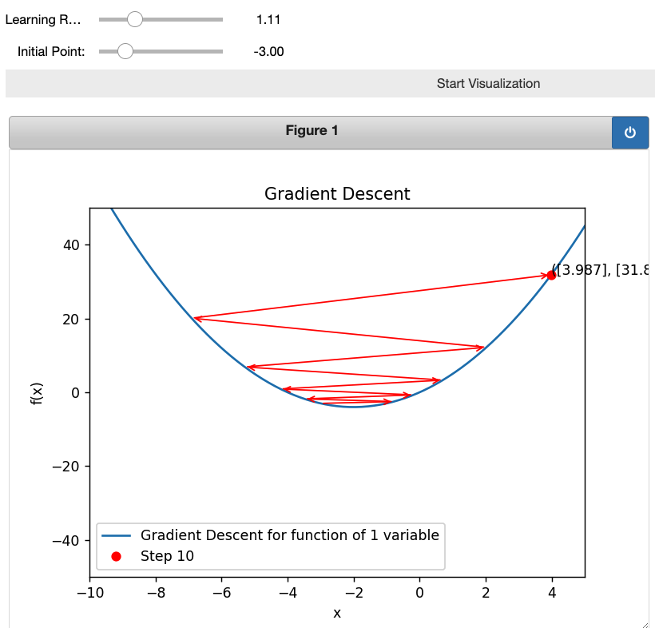
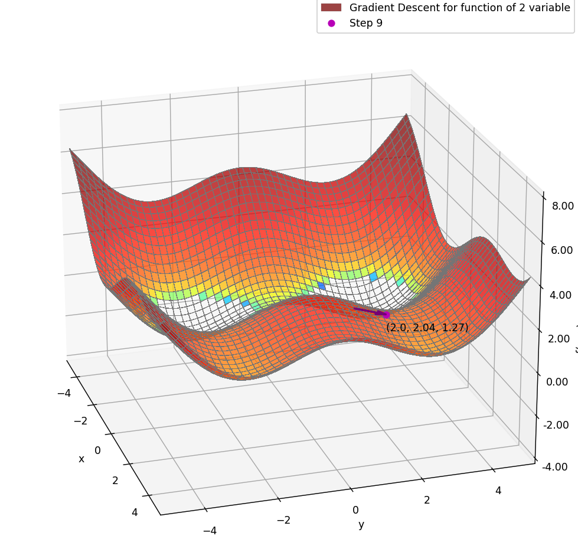

# Gradient_Descent_demo

A animated gradient descent demo. The codebase was originally created by Mrigankshi Kapoor.

## Create a conda enviroment

download Anaconda: https://www.anaconda.com/download/success

next you are going to use command line to set up the environment.

#### 1. Create a new conda environment

```bash
conda create -n "ret" python==3.9 -y
```

if you get any error, try this instead:

```bash
conda create -n "ret" conda-forge::python==3.9 -y
```

#### 2. Activate the environment

```bash
conda activate ret
```

#### 3. Install dependency

```bash
pip install -r requirements.txt
```

#### 4. launch the notebook from commandline (not GUI/navigator)

Under this folder, run:

```bash
jupyter notebook
```


## Examples

#### 2D example



#### 3D example


